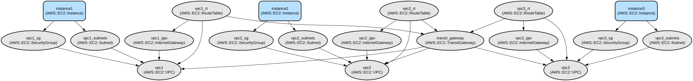

# AWS Multi-VPC Network Infrastructure with Transit Gateway

This project provides a Terraform configuration for deploying a secure multi-VPC network infrastructure in AWS with interconnected VPCs through a Transit Gateway. The infrastructure includes three VPCs with public subnets, EC2 instances running Nginx, and configured network routing for inter-VPC communication.

The infrastructure creates a hub-and-spoke network topology using AWS Transit Gateway, allowing seamless communication between three VPCs while maintaining network isolation and security. Each VPC hosts an EC2 instance running Nginx, accessible via both public internet and internal VPC networking. The configuration implements security best practices with properly configured security groups and route tables.

## Repository Structure
```
terraform/
├── main.tf                 # Main infrastructure configuration
├── modules/               
│   ├── ec2/               # EC2 instance configuration module
│   ├── transit-gateway/   # Transit Gateway configuration module
│   └── vpc/               # VPC and networking components modules
│       ├── eip/           # Elastic IP configuration
│       ├── nat/           # NAT Gateway configuration
│       ├── route_tables/  # Route tables configuration
│       ├── security_groups/ # Security groups configuration
│       ├── subnets/       # Subnet configuration
│       └── vpc/           # Base VPC configuration
├── outputs.tf             # Output definitions for resource attributes
├── provider.tf            # AWS provider configuration
├── scripts/              
│   └── user_data.sh      # EC2 instance initialization script
└── variables.tf          # Input variable definitions
```

## Usage Instructions
### Prerequisites
- AWS Account with appropriate permissions
- Terraform v1.0.0 or later
- AWS CLI configured with appropriate credentials
- Key pair named "madmaxkeypair" created in AWS

### Installation

1. Clone the repository:
```bash
git clone <repository-url>
cd <repository-directory>
```

2. Initialize Terraform:
```bash
terraform init
```

3. Review the configuration:
```bash
terraform plan
```

4. Apply the configuration:
```bash
terraform apply
```

### Quick Start
1. After deployment, you can access the EC2 instances using their public IPs:
```bash
terraform output instance1_ip
terraform output instance2_ip
terraform output instance3_ip
```

2. Connect to instances using SSH:
```bash
ssh -i path/to/madmaxkeypair.pem ubuntu@<instance-ip>
```

3. Access Nginx web server:
```bash
curl http://<instance-ip>
```

### More Detailed Examples
1. Testing Inter-VPC Communication:
```bash
# From instance1
ping <instance2-private-ip>
ping <instance3-private-ip>
```

2. Modifying Security Groups:
```hcl
module "vpc1_sg" {
  source = "./modules/vpc/security_groups"
  vpc_id = module.vpc1.vpc_id
  ingress = [
    {
      from_port   = 443
      to_port     = 443
      protocol    = "tcp"
      cidr_blocks = ["0.0.0.0/0"]
    }
  ]
}
```

### Troubleshooting
1. Transit Gateway Connectivity Issues:
- Check route table associations
- Verify security group rules
- Ensure subnet configurations are correct

2. EC2 Instance Access Issues:
- Verify security group ingress rules
- Check key pair permissions
- Confirm instance status in AWS Console

3. Nginx Access Issues:
- Check instance security group allows port 80
- Verify Nginx service status: `sudo systemctl status nginx`
- Review Nginx logs: `sudo tail -f /var/log/nginx/error.log`

## Data Flow
The infrastructure enables communication between VPCs through the Transit Gateway while maintaining public internet access through Internet Gateways.

```ascii
Internet
    ↕
    ║
┌───╨───┐     ┌─────────┐     ┌───────┐
│  IGW  │←────│  VPC 1  │←────│  EC2  │
└───┬───┘     └────┬────┘     └───────┘
    │              ↕
    │         ┌────┴────┐
    │         │ Transit │
    │         │ Gateway │
    │         └────┬────┘
    │              ↕
┌───┴───┐     ┌────┴────┐     ┌───────┐
│  IGW  │←────│  VPC 2  │←────│  EC2  │
└───┬───┘     └────┬────┘     └───────┘
    │              ↕
┌───┴───┐     ┌────┴────┐     ┌───────┐
│  IGW  │←────│  VPC 3  │←────│  EC2  │
└───────┘     └─────────┘     └───────┘
```

Component Interactions:
1. Each VPC has its own Internet Gateway for public internet access
2. Transit Gateway enables inter-VPC communication
3. Security groups control inbound/outbound traffic for EC2 instances
4. Route tables direct traffic between VPCs through Transit Gateway
5. EC2 instances run Nginx web servers accessible via public IP
6. User data script automatically installs and configures Nginx
7. Each VPC uses distinct CIDR ranges to prevent IP conflicts

## Infrastructure


### VPC Resources
- VPC 1: CIDR 10.1.0.0/24
- VPC 2: CIDR 10.2.0.0/24
- VPC 3: CIDR 10.3.0.0/24

### EC2 Instances
- Instance Type: t2.micro
- AMI: Ubuntu 22.04 LTS
- Auto-configured with Nginx

### Networking
- Transit Gateway: Enables inter-VPC communication
- Internet Gateways: One per VPC
- Security Groups: Allow ports 22 (SSH) and 80 (HTTP)

### Route Tables
- Public subnet routes to Internet Gateway
- Inter-VPC routes through Transit Gateway